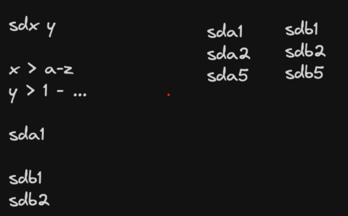

# Session 1 
## MBR (Master Boot Record)
In the past, if we detached a hard drive from a server, the data inside would become corrupted. In 1986, IBM created a standard called the MBR. Its purpose was to ensure that if we had 100 hard drives in our servers, the server could detect each hard drive.

### Features of MBR:
- Can see and partition hard drives with a maximum storage of 2TB.
- You can have 4 primary partitions or 3 primary partitions with 1 extended partition, and inside the extended partition, you can have 12 logical partitions.
- MBR occupies the first sector of the hard drive and stores data with the following structure:
    - 446 Bytes for Bootloader (this is a pointer to the bootloader, not the actual bootloader).
    - 64 Bytes for the partition table.
    - 2 Bytes for validation check (with the value 'aa55').

Note: The extended partition is created in software and has a size of 1KB.

Note: The bootloader for Linux is GRUB.

The smallest unit for segment counting in the hard drive is the sector. Each sector, based on the standard, has 512 Bytes or characters.


## GPT (GUID Partition Table)
GPT was created to fix the limitations of MBR.

### Features of GPT:
- There is no storage limitation, and we can have up to 9.7 million TB of storage.
- We can have 128 primary partitions (this is a Microsoft standard, but in Linux, you can have more).
- The first sector still exists, but with the CRC concept. This means that the first sector is backed up in other locations known only to GPT, and if something changes, GPT will recover it.

## When use GPT or MBR
- If you have BIOS, you have to use MBR.
- If you have UEFI, you have to use GPT.

## Implement Senario
to see all the block devices and get 'ls' from block devices write:
```bash
sadegh@sadegh:~$ lsblk
NAME                      MAJ:MIN RM  SIZE RO TYPE MOUNTPOINTS
loop0                       7:0    0 63.9M  1 loop /snap/core20/2318
loop1                       7:1    0   87M  1 loop /snap/lxd/27037
loop2                       7:2    0   87M  1 loop /snap/lxd/29351
loop3                       7:3    0 63.9M  1 loop /snap/core20/2105
loop4                       7:4    0 40.4M  1 loop /snap/snapd/20671
loop5                       7:5    0 38.8M  1 loop /snap/snapd/21759
sda                         8:0    0 25.2G  0 disk
├─sda1                      8:1    0    1M  0 part
├─sda2                      8:2    0    2G  0 part /boot
└─sda3                      8:3    0 23.2G  0 part
  └─ubuntu--vg-ubuntu--lv 253:0    0 11.6G  0 lvm  /
```

linux names the files with its structure and will name them with *hd** (for old hard like PATA) or *sd** (for newer hard like SATA) you can see the structure of naming in the below image 



NOTE: based on the standard logical partitions starts with 5 number like sda5 and etc.

in the above image we have 2 hards (sda and sdb) and the first and second one start with 2 primary partitions (sda1, sda2, sdb1, sdb2) and both of them has extended partition that inside that partition they have logical partition (sda5, sdb5).

### implementation of adding a hard to vm and make partition for that
1- turn off the machine and add a disk with like 10GB storage

2- make lsblk to see if the new hard added successfully (you should see something new like 'sdb')

3- we will get 'ls' from the '/dev' and see the below result 

NOTE: in the above image 'b' represent 'block device file' that will notice you a hard or partition that include some blocks and if you see 'd' represent to a directory

4- write 'fdisk', this command will use to make partition with MBR standard
```bash
fdisk -l | less
```
in the above command you can get information above the partitions

5- to make partition for your hard write the below command
```bash
fdisk /dev/sdb
```

6- now write 'n' to create new partition and it will ask you partition type (primary or extended) then ask you the partition number (default is 1 to 4), then it will ask you to specify the first sector and show you from which number it will start for exmaple here it will start from 2048 and the before 2047 is reserved, at the end it will ask you to specify last sector (you can give sector number or just give size of that for exampl 2GB. in the below image we have created out first primary partition


NOTE: if you write 'p' in 'fdisk' you can see the result of what you do till here, for exmaple here will show you have created your primary partition


NOTE: everything you have done right now is happened in RAM and nothing has been write in the hard but in the future we will write our works in the hard.

to create 2 other primary partitions just do what you have did to create the first primary partition.

7- now to create extended partition write 'n' then 'e', just give the partition number, first sector and last sector with for example 2GB storage for your extended partition.


NOTE: the storage you specify for extended partiton is all you can have for storage of your all logical partition can have for exampl if you specify 2GB for your extended partition, you can just have 2GB of logical partitions for example 3 logical partitions with size of (500MB, 1GB, 500MB)

8- to create a logical partition now just enter 'n' and just set the first sector and last sector (or size) of your logical partition.

9- when you create your all partitions (primary, extended and logical) you should write it because till here everything is in the RAM. when you write 'w' get this response: 
'Syncing disks'

NOTE: to check if everything work well write below command and if you get '0' for response means everything is 'ok':
```bash
echo $?
```

### mount created partitions
now we have created our partitions of our hard but we can't use them because we should mount them to somewhere of our FSHL and after mount them we need fileystem for them. 
File system is something like shelf that we should put woods with the correct shape that we could put books inside that. how to put these books inside that shelf should be specify.

first step after making partitions we have to format (in windows) or install file system (for linux).

Filesystem is the data structure that specify what data and how to put data in a partition. Filesystem will specify verbal protocol between kernel and hard. 

In linux we have these filesystems: 
