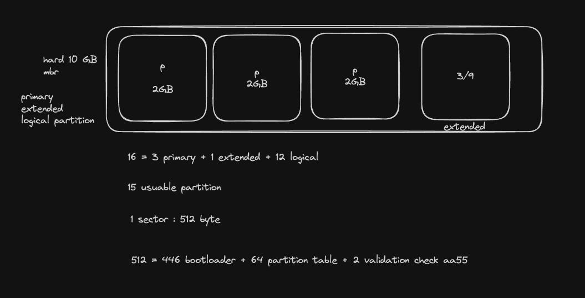

# Session 1 
## MBR (Master Boot Record)
In the past, if we detached a hard drive from a server, the data inside would become corrupted. In 1986, IBM created a standard called the MBR. Its purpose was to ensure that if we had 100 hard drives in our servers, the server could detect each hard drive.

### Features of MBR:
- Can see and partition hard drives with a maximum storage of 2TB.
- You can have 4 primary partitions or 3 primary partitions with 1 extended partition, and inside the extended partition, you can have 12 logical partitions.
- MBR occupies the first sector of the hard drive and stores data with the following structure:
    - 446 Bytes for Bootloader (this is a pointer to the bootloader, not the actual bootloader).
    - 64 Bytes for the partition table.
    - 2 Bytes for validation check (with the value 'aa55').

Note: The extended partition is created in software and has a size of 1KB.

Note: The bootloader for Linux is GRUB.

The smallest unit for segment counting in the hard drive is the sector. Each sector, based on the standard, has 512 Bytes or characters.

## GPT (GUID Partition Table)
GPT was created to fix the limitations of MBR.

### Features of GPT:
- There is no storage limitation, and we can have up to 9.7 million TB of storage.
- We can have 128 primary partitions (this is a Microsoft standard, but in Linux, you can have more).
- The first sector still exists, but with the CRC concept. This means that the first sector is backed up in other locations known only to GPT, and if something changes, GPT will recover it.

## When use GPT or MBR
- If you have BIOS, you have to use MBR.
- If you have UEFI, you have to use GPT.

## Implement Senario

